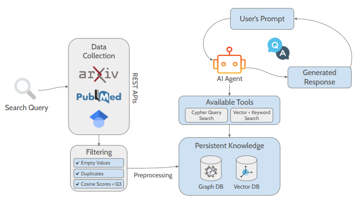
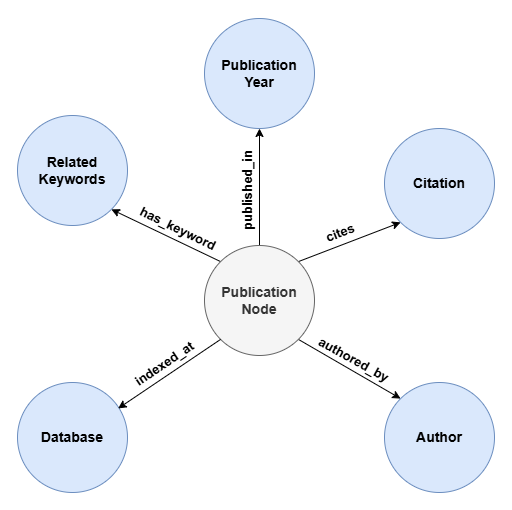
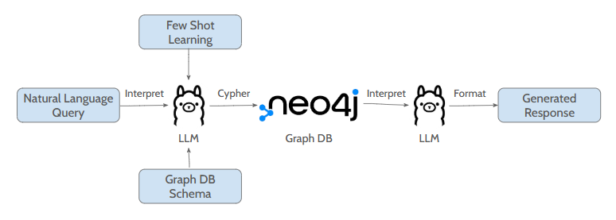
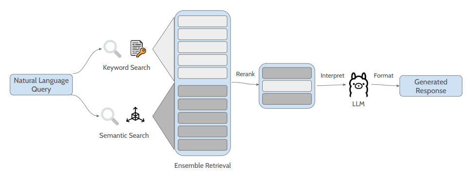

# Open-Source Agentic Hybrid RAG Pipeline

## Overview
This project presents a **fully open-source, Python-based pipeline for automatically extracting, processing, and analyzing academic literature using a hybrid architecture that combines a knowledge graph (KG) and a vector store (VS)**, as illustrated on Figure 1.

  
*Figure 1: Pipeline Architecture.*  

The system collects bibliometric data from **PubMed, arXiv, and Google Scholar**, processes it into structured formats, and enables **AI-powered question answering (QA)** by allowing an intelligent agent to **choose between symbolic (Cypher) and semantic (vector) search based on the user's query**.

Building on that, Figure 2 illustrates the structure of the generated KG, where nodes such as Author, Database, Related Keywords, Publication Year, and Citation are shared across multiple publications, **forming rich interconnections between articles**.

 
*Figure 2: Knowledge Graph Schematic Model.*

Each Publication node retains key internal attributes (e.g., DOI, title, abstract), enabling granular retrieval and analysis. By modeling bibliometric data this way, the system **supports powerful structural and descriptive queries** — such as exploring co-authorship networks, temporal trends, database coverage, and citation paths—to provide a comprehensive view of the academic research landscape.

## Available Functions

Figure 3 presents the GraphRAG mechanism, which **enables querying the knowledge graph through natural language**. The user’s prompt is first passed to a language model, along with the graph schema and a curated set of 30 example input-output pairs to support few-shot learning. This helps the model generate accurate Cypher queries that align with the KG structure.

The resulting Cypher query is then executed against the Neo4j-hosted knowledge graph, and the output is forwarded back to the LLM to format a coherent, human-readable response — creating a seamless natural language to structured data pipeline.

 
*Figure 3: KG Retrieval Function with Cypher query mode.*

Figure 4 illustrates the VectorRAG process, which **combines keyword-based and semantic search via an ensemble retriever**. The returned text chunks are merged and reranked using Cohere’s ´rerank-english-v3.0´ model. This Transformer-based reranker evaluates the relevance between the query and each passage using deep cross-attention, **refining the results by emphasizing the most informative content**.

The top-ranked passages are then forwarded to the language model, which uses them as context to generate and structure a final answer — **boosting both accuracy and fluency in open-domain question answering**.

 
*Figure 4: VS Retrieval Function.*

The **integration of knowledge graphs and vector-based** storage, mediated by natural language agents, provides a **robust and flexible approach** for automated knowledge extraction from scientific literature. The proposed pipeline demonstrates how complementary retrieval mechanisms — structured via Cypher and semantic via embeddings — can be intelligently orchestrated by an agent to generate **more accurate and contextually enriched responses**. By enabling analytical and descriptive queries about publications, authors, and citation patterns, this hybrid architecture **enhances bibliometric exploration and insight generation**, contributing to the development of more transparent, efficient, and interpretable tools in support of scientific research.

## Table of Contents
- [Features](#features)  
- [Prerequisites](#prerequisites)  
- [Installation](#installation)  
  - [Using Docker](#using-docker)  
  - [Using Python Virtualenv](#using-python-virtualenv)  
- [Configuration](#configuration)  
- [Usage](#usage)  
- [Directory Structure](#directory-structure)  
- [License](#license)  

## Features
- Ingest bibliometric data (PubMed, ArXiv, Google Scholar)  
- Build Neo4j knowledge graph with citation relationships  
- Chunk & embed full-text PDFs into FAISS vector store using LLaMA-3  
- Agentic orchestration:  
  - **GraphRAG** (Cypher queries over KG)  
  - **VectorRAG** (BM25 + dense retrieval + reranking)  
- Instruction tuning with Mistral-7B-Instruct-v0.2   
- Bootstrapped evaluation with error estimates  

## Prerequisites
- Docker Engine ≥ 20.10  
- Python ≥ 3.11 (if running natively)  
- Neo4j Community Edition ≥ 4.4  
- FAISS-compatible hardware  

## Installation

### Using Docker
1. Clone the repository:  
   ```bash
   git clone https://github.com/Kamaleswaran-Lab/Agentic-Hybrid-Rag.git
